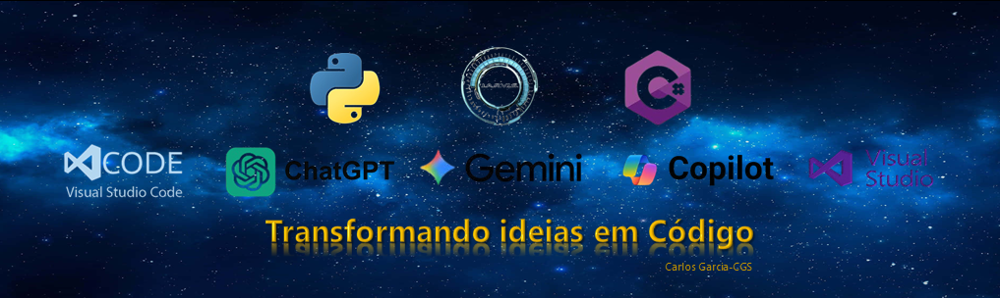
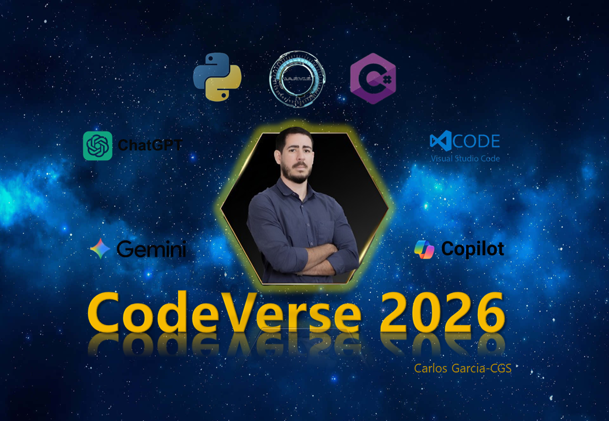
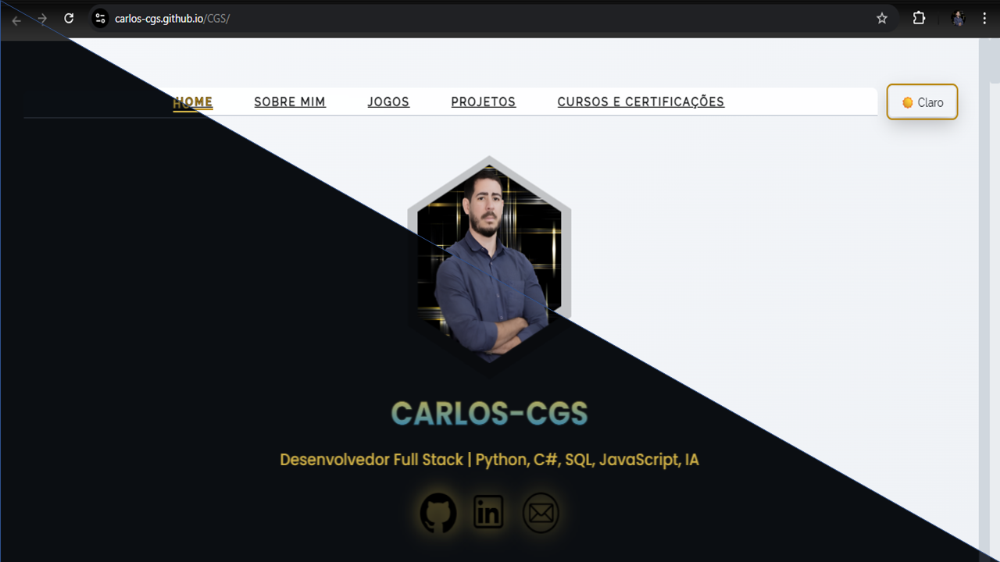

<h1 align="center" style="font-size:3em; margin-bottom:0;">🌌CodeVerse2026</h1>

	

	
	
	

	<i>Compartilhando evolução real em tecnologia, projetos e artigos práticos.</i>

---

# Índice

- [🎯 Objetivo](#-objetivo-do-projeto)
- [🗓️ Frequência dos Artigos](#-frequência-dos-artigos)
- [📚 Artigos Publicados](#-artigos-publicados)
- [🧑‍💻 Para quem é este projeto?](#-para-quem-é-este-projeto)
- [💡 Por que acompanhar?](#-por-que-acompanhar)
- [🤝 Como contribuir](#-como-contribuir)
- [🧠 Filosofia do Projeto](#-filosofia-do-projeto)
- [🙏 Agradecimento](#-agradecimento)

---

**CodeVerse2026** é um projeto editorial e técnico onde compartilho, de forma contínua e prática, minha evolução na área de tecnologia por meio de **artigos e projetos reais**.

Este repositório funciona como o **hub central** do projeto: aqui ficam organizados os conteúdos publicados, links dos artigos, capas e referências técnicas.

A proposta é simples: aprender construindo, refletindo e compartilhando — sem atalhos e sem romantização.

---

## 🎯 Objetivo do Projeto

- Documentar minha jornada em tecnologia ao longo de 2026
- Compartilhar projetos reais, refatorações e decisões técnicas
- Criar um histórico organizado e acessível dos artigos publicados
- Ajudar desenvolvedores juniores e pessoas em transição de carreira

## 🗓️ Frequência dos Artigos

Os artigos do **CodeVerse2026** são publicados **a cada 15 dias**, sempre às **segundas-feiras**, no LinkedIn.

Cada edição pode ser:

- um artigo técnico,
- a apresentação de um projeto,
- ou um estudo/reflexão prática sobre desenvolvimento de software.

## 📚 Artigos Publicados

<a href="https://www.linkedin.com/build-relation/newsletter-follow?entityUrn=7285111960604434433" target="_blank">Assinar no LinkedIn</a>

A tabela abaixo será atualizada conforme novos artigos forem publicados.

| Data       | Título do Artigo                       | Plataforma | Capa                                                    | Link                                                                                                                                                                                 |
| ---------- | -------------------------------------- | ---------- | ------------------------------------------------------- | ------------------------------------------------------------------------------------------------------------------------------------------------------------------------------------ |
| 12/01/2026 | Apresentação do CodeVerse2026          | LinkedIn   |  | [🔗Link do Artigo 01](https://www.linkedin.com/pulse/codeverse2026-um-novo-cap%C3%ADtulo-da-minha-jornada-em-tech-cgs-1rv2f/?trackingId=EjIiUwI%2BQzvI%2FA0Ssc7TaQ%3D%3D)            |
| 26/01/2026 | Atualização e Refatoração do Portfólio | LinkedIn   |  | [🔗 Link do Artigo 02](https://www.linkedin.com/pulse/renovei-meu-portf%C3%B3lio-da-est%C3%A9tica-ao-pensamento-de-produto-cgs-cddwf/?trackingId=2VBC%2FArdW%2BbVVsZ8a%2FgGqw%3D%3D) |
| 09/02/2026 | CodeVerse2026                          | LinkedIn   |                    | [🔗 CodeVerse2026]()                                                                                                                                                                 |
| 23/02/2026 | CodeVerse2026                          | LinkedIn   |                    | [🔗 CodeVerse2026]()                                                                                                                                                                 |

## 🧑‍💻 Para quem é este projeto?

- Pessoas em transição de carreira para tecnologia
- Devs juniores buscando exemplos reais
- Quem quer aprender com projetos práticos e reflexões sinceras

---

## 💡 Por que acompanhar?

- Conteúdo transparente, sem romantização
- Aprendizado contínuo, com erros e acertos
- Projetos reais, não só teoria
- Comunidade aberta para troca de experiências

---

## 🤝 Como contribuir

1. Dê uma estrela ⭐ no repositório!
2. Compartilhe feedbacks, ideias ou dúvidas via [issues](https://github.com/Carlos-CGS/CodeVerse2026/issues)
3. Siga no LinkedIn e compartilhe os artigos

---

## 🧠 Filosofia do Projeto

> "Evoluir em tecnologia não é sobre fazer tudo rápido.  
> É sobre **entender, organizar, corrigir e finalizar**."

O **CodeVerse2026** é um projeto vivo — assim como qualquer sistema bem construído.

Seguimos evoluindo.  
**Um projeto de cada vez.** 🚀

---

## 🙏 Agradecimento

Obrigado por acompanhar! Se gostou, compartilhe e participe. Sua interação faz o projeto crescer!

- Documentar minha jornada em tecnologia ao longo de 2026
- Compartilhar projetos reais, refatorações e decisões técnicas
- Criar um histórico organizado e acessível dos artigos publicados
- Ajudar desenvolvedores juniores e pessoas em transição de carreira

